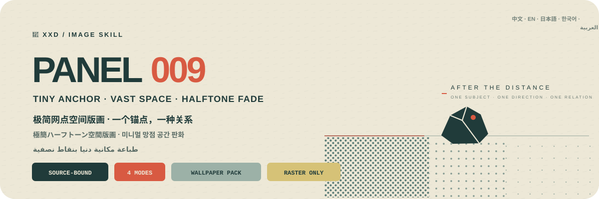

<p align="center">
  
</p>

<div align="center">

# 🦁 XXD Panel 009

### Compress a photograph into one small anchor, vast paper space, and a dense-to-sparse halftone poem

[](./SKILL.md)
[](#four-outputs-one-halftone-spatial-logic)
[](#boundaries-and-trust)

<a href="README.md">简体中文</a> · <strong>English</strong> · <a href="README.ja.md">日本語</a> · <a href="README.ko.md">한국어</a> · <a href="README.ar.md">العربية</a>

</div>

> TINY ANCHOR · VAST NEGATIVE SPACE · ONE SPATIAL RELATION · SPOT COLOUR · HALFTONE SCREENPRINT

XXD Panel 009 is an image-generation Skill for Codex and compatible agents. It locks the source's subject, contour, pose, and narrative relation, compresses complexity into one tiny but instantly recognisable anchor, then chooses only one direction and one spatial relation. A vast paper-toned field becomes distance, air, pause, and time.

The image uses only a paper base, one main ink, and an optional mist layer. Every fog bank, depth cue, shadow, fade, and transition is made by halftone dots moving from dense to sparse—never digital blur or an ordinary gradient. Paper grain, screenprint ink, slight misregistration, and uneven coverage keep the print physical; type enters through horizon, contour, axis, halftone boundary, or negative shape.

## Why it exists

An “artful vintage poster” easily collapses into a template: shrink the subject, add old paper, paste in English catalogue numbers and a soft gradient, then call it poetic.

009 reverses that logic:

```text
lock source facts → compress into one unique anchor → choose one direction and one spatial relation → make paper space carry distance and time → organise paper/main-ink/mist spot colours → build every transition through halftone density → embed type into spatial structure
```

If an unrelated photograph could replace the source without materially changing the anchor, direction, spatial relation, halftone path, composite colour temperature, or copy, the result is not 009.

## The 009 visual contract

- **One tiny anchor:** at least three source-specific cues preserve identity, contour, pose, action, and relation with extremely little information.
- **One direction:** choose only horizontal extension, vertical extension, isolated suspension, outward dissipation, or shallow-to-deep recession.
- **One spatial relation:** one horizon, boundary, shadow, or halftone band is enough; never stack composition tricks.
- **Negative space is the subject:** paper tone occupies the largest area and carries distance, air, pause, time, or isolation.
- **Two or three spot colours:** paper base, one quiet weighty main ink, and an optional lighter greyer mist layer; any accent is tiny and narratively earned.
- **Halftone carries transition:** fog, depth, shadow, and fading use dense-to-sparse dots only.
- **Physical print evidence:** paper grain, ink, slight misregistration, and uneven coverage stay tactile without a cheap distressed filter.
- **Intelligent type intervention:** a very short title and sparse microtype enter the horizon, contour, axis, halftone boundary, or negative shape.

## Samples · Coming soon

The repository reserves [`assets/examples/`](assets/examples/) for future work. Only finished 009 artwork verified by the project owner will be added; no post or image from another style is used as a placeholder.

Future samples will demonstrate 009's adaptability. Their subjects, metaphors, palette, copy, and canvas ratios will never become generation references or defaults.

## Four outputs, one halftone spatial logic

The four modes support single or multiple selection. Reply with `1`, `1+3`, `1,2,4`, or `all`; the Skill deduplicates and runs them in menu order 1→4. Every mode is delivered independently in its own task directory—never as an overview—and `all` yields seven PNGs per source (one for each ordinary mode plus four wallpapers). Sizes may be labelled by mode in the same reply; unlabeled ordinary modes remain source-adaptive. Copy is shared across selected modes by default and may be overridden per mode.

| Mode | Sizing logic | Deliverable |
| --- | --- | --- |
| `top-bottom` | source-adaptive | complete source above, 009 minimal halftone spatial print below; both panels retain the source size and split exactly 50/50 |
| `left-right` | source-adaptive | complete source left, 009 minimal halftone spatial print right; both panels retain the source size and split exactly 50/50 |
| `design-only` | source-adaptive | transformed design only, with no visible source photo; retains source ratio and dimensions |
| `wallpaper-pack` | four device sizes | separate phone, iPad, desktop, and children's-watch PNGs |

Exact user pixels > explicit ratio or destination > source adaptation for ordinary modes. The original `009.md` used a 3:4 creative canvas, but that historical example is not a silent default in the current Skill.

Photography in paired modes stays truthful, with only restrained grading and necessary environmental extension. Design-only and wallpapers still use the photograph as evidence but do not show it.

### Wallpaper packs: linked or independent

Wallpaper mode has no silent size default. Choose the common preset—phone `1440×3200`, iPad `2048×2732`, desktop `3840×2160`, watch `1024×1024`—or give labelled custom sizes.

- **Linked pack (recommended):** generate and approve the iPad anchor first; every other device references the original photo plus that same anchor and is recomposed for its canvas.
- **Independent set:** every device references only the source photograph and may explore different tiny-anchor placements, single directions, spatial relations, spot-colour groups, halftone paths, and type interventions.

Linked never means cropped. All four files are separately generated, composed, and reviewed, with no iPad→phone→desktop→watch reference chain.

## Copy must belong to the spatial and print structure

Before generation, choose automatic copy, custom copy, or text-free output. Name the target language or locale whenever copy is present.

Automatic copy distils one extremely short title from the photograph's visible or supported subject, emotion, time, action, material, distance, or metaphor. It may be abstract, literary, curatorial, and restrained, but must remain inseparable from this image.

Add zero to three micro-notes, restrained lines, chapter marks, numbers, years, coordinate-like figures, or archival-style signs only when useful. Dates, coordinates, locations, years, numbers, and provenance must be supplied or reliably established; they are never fabricated merely to look sophisticated. Copy must still pass the unrelated-image swap test.

Finished user wording stays verbatim. A direction or editable draft is refined only while preserving audience, purpose, mandatory words, tone, and implication.

Language follows the intended audience rather than the command language:

```text
target market or audience > requested output language > direction language; if none is explicit, ask before generation
```

A Japanese edition uses natural Japanese, a Korean-audience edition uses natural Korean and correct spacing, a UK edition uses British English, and Arabic defaults to natural Modern Standard Arabic with genuine right-to-left composition. The Skill never guesses nationality from appearance, clothing, scenery, or signs and never uses pseudo-foreign text.

## Code guarantees geometry; image generation creates the artwork

The image model creates a source-bound tiny anchor, one direction and spatial relation, vast paper-toned negative space, limited spot colours, halftone density transitions, physical screenprint evidence, and type embedded in space. `scripts/compose_panel.py` only plans canvases, performs exact 50/50 raster composition, finalises dimensions, and audits results. It never fakes artwork with programmatic drawing.

```bash
python3 scripts/compose_panel.py --plan --layout top-bottom --source photo.png
python3 scripts/compose_panel.py --plan --layout left-right --size 2560x1440
python3 scripts/compose_panel.py --audit result.png --layout design-only --size 2048x2048
```

Exact top-bottom canvases need an even total height; left-right canvases need an even total width. Requested pixels are never silently changed.

## Get started

```bash
git clone https://github.com/nevertoday/xxd-panel-009.git
mkdir -p ~/.codex/skills
ln -s "$(pwd)/xxd-panel-009" ~/.codex/skills/xxd-panel-009
```

Claude Code users may link the same directory to `~/.claude/skills/xxd-panel-009`. Restart the agent session after installation.

```text
$xxd-panel-009
Turn this photograph into a left-right composition. Derive the copy from the image and write it in natural Korean.
```

You may invoke the Skill with only a photograph. It first asks for one or more modes in a numbered multiline menu, then for copy settings; wallpaper mode also asks for linked/independent continuity and device sizes.

Full specifications:

- [Skill workflow](SKILL.md)
- [Chinese full prompt](references/xxd-panel-009-prompt.zh-CN.md)
- [English full prompt](references/xxd-panel-009-prompt.en.md)
- [Original style brief](references/009-source.md)

## Boundaries and trust

- Each photograph stays within its own task and never borrows subjects, colours, copy, or composition from other inputs, old results, or samples.
- Every invocation creates a fresh task directory; even identical sources and parameters must generate anew.
- Deliverables are PNG bitmaps, never SVG, HTML, Canvas, or programmatic-drawing substitutes.
- The configured bitmap bridge emits sanitised status only and does not expose providers, endpoints, headers, credentials, prompts, or response bodies.
- Each selected ordinary mode returns one file; selected `wallpaper-pack` adds four separate wallpapers. `all` returns seven PNGs per source across four sibling mode directories, never a contact sheet or overview.

Local composition needs Python 3 and Pillow. The safe bitmap bridge uses Python 3.11+ `tomllib`. Image generation still requires a host agent with built-in raster generation or an already configured compatible raster route.

## Repository

```text
xxd-panel-009/
├── SKILL.md
├── README.md / README.en.md / README.ja.md / README.ko.md / README.ar.md
├── agents/openai.yaml
├── assets/
│   ├── banner.svg
│   └── examples/ (reserved for future local samples)
├── scripts/
│   ├── compose_panel.py
│   └── configured_imagegen.py
└── references/
    ├── xxd-panel-009-prompt.zh-CN.md
    ├── xxd-panel-009-prompt.en.md
    └── 009-source.md
```

## About XXD

XXD is the abbreviated brand name of Xiaoxiaodong. This project is created and maintained by [@xiaoxiaodong01](https://x.com/xiaoxiaodong01).

## Support and Membership

### In-depth Consultation · CNY 299/hour

One-to-one consultation for using the Skills is billed at CNY 299 per hour. Contact Xiaoxiaodong through the WeChat QR code below to book.

### Xiaoxiaodong Skills User Community · CNY 99 to join

A one-time CNY 99 fee joins the community for workflow sharing, work discussion, and peer support. It does not include hourly one-to-one consultation. Include “Skills User Community” in your WeChat message.

### Knowledge Planet + Member Prompt Library · CNY 699/year

[Knowledge Planet](https://wx.zsxq.com/group/15554814142882) and the [XXD Member Prompt Library](https://vip.xiaoxiaodong.ai/) are one membership: **one annual payment unlocks both, with no second purchase required.**

1. Subscribe through [Knowledge Planet](https://wx.zsxq.com/group/15554814142882), then contact Xiaoxiaodong on WeChat for a Prompt Library redemption code.
2. Subscribe through the [Member Prompt Library](https://vip.xiaoxiaodong.ai/), then contact Xiaoxiaodong on WeChat for a Knowledge Planet invitation.

<p align="center">
  <a href="https://xiaoxiaodong.pages.dev/assets/wechat-qr.png"></a>
</p>

<div align="center">

**Leave complexity to the photograph; give distance, pause, and echo to one small anchor and the whole sheet.**

</div>

---

<div align="center">
  <h2>☕ Support this open-source project</h2>
  <p>If this project saved you time, a Star, a share, or a coffee helps keep it moving.</p>
  <table>
    <tr>
      <td align="center" width="240">
        <a href="https://github.com/nevertoday/zhongguo-traditional-colors/blob/main/docs/images/buy-me-a-coffee-qr.png?raw=true"></a><br>
        <strong>Buy me a coffee</strong><br>
        <sub>Scan or open the QR code to support Xiaoxiaodong</sub>
      </td>
    </tr>
  </table>
  <p><sub>Support is entirely optional and never changes access to this open-source project.</sub></p>
</div>
